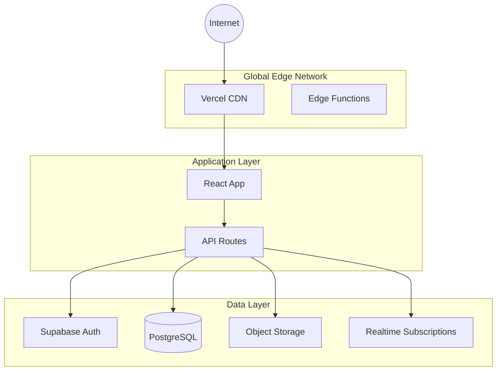

# Holistic Wellness Community Platform Infrastructure Architecture

## Infrastructure Overview

- **Cloud Provider:** Supabase (PostgreSQL + Auth + Storage + Realtime) with Vercel for hosting
- **Core Services:** Supabase Database, Supabase Auth, Supabase Storage, Supabase Realtime, Vercel Edge Network
- **Regional Architecture:** Multi-region with primary in US East, automatic edge distribution via Vercel
- **Multi-environment Strategy:** Development (local), Staging (preview deployments), Production (main branch)

## Infrastructure as Code (IaC)

- **Tools & Frameworks**
  - Supabase CLI for database migrations and schema management
  - GitHub Actions for CI/CD automation
  - Vercel CLI for deployment configuration
  - Environment variables managed via Vercel dashboard

- **Repository Structure**
  ```
  /
  ├── supabase/
  │   ├── migrations/     # SQL schema migrations
  │   ├── functions/      # Edge functions (future)
  │   └── config.toml     # Supabase configuration
  ├── .github/
  │   └── workflows/      # CI/CD pipelines
  └── vercel.json         # Vercel configuration
  ```

- **State Management**
  - Database state managed through sequential migrations
  - Deployment state tracked by Vercel
  - Environment configs stored in Vercel dashboard

- **Dependency Management**
  - npm/pnpm for application dependencies
  - Supabase CLI for database tooling
  - Automated dependency updates via Dependabot

<critical_rule>All infrastructure must be defined as code. No manual resource creation in production environments.</critical_rule>

## Environment Configuration

- **Environment Promotion Strategy**
  - Git flow: feature branches → develop → main
  - Automatic preview deployments for PRs
  - Manual promotion to production

- **Configuration Management**
  - Environment variables per deployment
  - Supabase project per environment
  - Build-time and runtime configuration separation

- **Secret Management**
  - Supabase API keys in Vercel environment variables
  - JWT secrets managed by Supabase Auth
  - No secrets in code repository

- **Feature Flag Integration**
  - Environment-based feature toggling
  - Runtime configuration for A/B testing

### Development Environment
- **Purpose:** Local development and testing
- **Resources:** Local Supabase instance, Vite dev server
- **Access Control:** Developer localhost only
- **Data Classification:** Test data only

### Staging Environment
- **Purpose:** Integration testing and QA
- **Resources:** Dedicated Supabase project, Vercel preview deployments
- **Access Control:** Development team and QA
- **Data Classification:** Sanitized production-like data

### Production Environment
- **Purpose:** Live user-facing application
- **Resources:** Production Supabase project, Vercel production deployment
- **Access Control:** Restricted to DevOps and senior developers
- **Data Classification:** Real user data, PII, payment information

## Environment Transition Strategy

- **Development to Production Pipeline**
  1. Local development with feature branches
  2. PR creation triggers preview deployment
  3. Code review and automated tests
  4. Merge to main triggers production deployment

- **Deployment Stages and Gates**
  - Lint and type checking
  - Unit and integration tests
  - Build verification
  - Security scanning
  - Manual approval for production

- **Approval Workflows and Authorities**
  - PR approval required from code owner
  - Production deployment requires senior developer approval
  - Database migrations require DBA review

- **Rollback Procedures**
  - Vercel instant rollback to previous deployment
  - Database migration rollback scripts
  - Feature flag kill switches

- **Change Cadence and Release Windows**
  - Continuous deployment for non-breaking changes
  - Weekly release windows for major features
  - Emergency hotfix process available 24/7

## Network Architecture

- **VPC/VNET Design**
  - Supabase managed network infrastructure
  - Isolated database instances per project
  - SSL/TLS encryption for all connections

- **Subnet Strategy**
  - Public: Vercel edge network, API endpoints
  - Private: Database connections, internal services

- **Security Groups & NACLs**
  - Supabase RLS policies for data access
  - API rate limiting at edge
  - IP allowlisting for admin access

- **Load Balancers & API Gateways**
  - Vercel edge network for global distribution
  - Automatic load balancing and failover
  - GraphQL and REST API endpoints



## Data Resources

- **Database Deployment Strategy**
  - PostgreSQL with Row Level Security
  - Connection pooling via PgBouncer
  - Read replicas for analytics (future)

- **Backup & Recovery**
  - Daily automated backups (Supabase managed)
  - Point-in-time recovery available
  - 30-day retention period

- **Replication & Failover**
  - Automatic failover within region
  - Cross-region replication for DR (future)
  - Real-time data synchronization

- **Data Migration Strategy**
  - Sequential SQL migrations
  - Zero-downtime migration patterns
  - Rollback scripts for each migration

## Security Architecture

- **IAM & Authentication**
  - Supabase Auth with JWT tokens
  - OAuth providers (Google, GitHub)
  - Multi-factor authentication support
  - Session management and refresh tokens

- **Network Security**
  - TLS 1.3 for all connections
  - Web Application Firewall at edge
  - DDoS protection via Vercel

- **Data Encryption**
  - Encryption at rest (AES-256)
  - Encryption in transit (TLS)
  - Column-level encryption for PII

- **Compliance Controls**
  - GDPR compliance features
  - Data retention policies
  - Audit logging enabled
  - Privacy by design

- **Security Scanning & Monitoring**
  - Automated dependency scanning
  - OWASP Top 10 protection
  - Security headers enforcement
  - Regular penetration testing

<critical_rule>Apply principle of least privilege for all access controls. Document all security exceptions with business justification.</critical_rule>

## Shared Responsibility Model

| Component            | Supabase      | Platform Team | Dev Team       | Security Team |
| -------------------- | ------------- | ------------- | -------------- | ------------- |
| Physical Security    | ✓             | -             | -              | Audit         |
| Network Security     | ✓             | Config        | -              | Audit         |
| Database Security    | Engine        | RLS Policies  | Queries        | Review        |
| Application Security | -             | Tools         | ✓              | Review        |
| Data Encryption      | ✓             | Config        | Implementation | Standards     |
| Access Control       | Auth Engine   | Policies      | Implementation | Audit         |

## Monitoring & Observability

- **Metrics Collection**
  - Vercel Analytics for performance metrics
  - Supabase Dashboard for database metrics
  - Custom metrics via edge functions

- **Logging Strategy**
  - Structured JSON logging
  - Log aggregation in Vercel
  - Database query logging

- **Tracing Implementation**
  - Request tracing with correlation IDs
  - Database query performance tracking
  - User journey analytics

- **Alerting & Incident Response**
  - Error rate monitoring
  - Performance degradation alerts
  - On-call rotation schedule
  - Incident response runbooks

- **Dashboards & Visualization**
  - Real-time performance dashboard
  - User analytics dashboard
  - Database health monitoring
  - Cost tracking dashboard

## CI/CD Pipeline

- **Pipeline Architecture**
  - GitHub Actions for automation
  - Vercel integration for deployments
  - Automated testing at each stage

- **Build Process**
  1. Code checkout
  2. Dependency installation
  3. Lint and type checking
  4. Unit test execution
  5. Build optimization
  6. Security scanning

- **Deployment Strategy**
  - Blue-green deployments
  - Instant rollback capability
  - Progressive rollout options

- **Rollback Procedures**
  - One-click rollback in Vercel
  - Database migration rollback
  - Feature flag overrides

- **Approval Gates**
  - Automated quality gates
  - Manual approval for production
  - Security scan pass required

## Disaster Recovery

- **Backup Strategy**
  - Daily automated backups
  - Geographic redundancy
  - Encrypted backup storage
  - Regular restore testing

- **Recovery Procedures**
  1. Assess impact and scope
  2. Initiate recovery runbook
  3. Restore from backup
  4. Verify data integrity
  5. Resume operations

- **RTO & RPO Targets**
  - RTO: 4 hours
  - RPO: 24 hours
  - Critical data: 1 hour RPO

- **DR Testing Approach**
  - Quarterly DR drills
  - Automated backup verification
  - Recovery time measurement
  - Lessons learned documentation

<critical_rule>DR procedures must be tested at least quarterly. Document test results and improvement actions.</critical_rule>

## Cost Optimization

- **Resource Sizing Strategy**
  - Right-sized database instances
  - Automatic scaling policies
  - Resource utilization monitoring

- **Reserved Instances/Commitments**
  - Supabase Pro plan for production
  - Vercel Pro plan for team features
  - Annual commitment discounts

- **Cost Monitoring & Reporting**
  - Monthly cost reports
  - Per-feature cost allocation
  - Budget alerts configuration

- **Optimization Recommendations**
  - Database query optimization
  - Edge caching strategies
  - Static asset optimization
  - Unused resource cleanup

## Platform Capabilities

- **Developer Self-Service**
  - Preview deployments for every PR
  - Environment variable management
  - Database migration tools
  - Local development setup

- **GitOps Workflows**
  - Infrastructure as code
  - Automated deployments
  - Configuration management
  - Rollback capabilities

- **Service Mesh Integration**
  - API gateway functionality
  - Rate limiting and throttling
  - Request routing rules
  - Authentication middleware

- **Developer Experience**
  - Comprehensive documentation
  - Local development tools
  - Debugging capabilities
  - Performance profiling

## Infrastructure Evolution

- **Technical Debt Inventory**
  - Migration to edge functions for API routes
  - Implementation of caching layer
  - Database query optimization
  - Security hardening improvements

- **Planned Upgrades and Migrations**
  - Q1 2025: Edge function migration
  - Q2 2025: Redis caching implementation
  - Q3 2025: Multi-region deployment
  - Q4 2025: Advanced analytics platform

- **Technology Roadmap**
  - GraphQL API implementation
  - WebSocket scaling improvements
  - Machine learning infrastructure
  - Advanced monitoring solutions

- **Capacity Planning**
  - 10x user growth accommodation
  - Database scaling strategy
  - Storage growth projections
  - Performance benchmarking

## Integration with Application Architecture

- **Service-to-Infrastructure Mapping**
  - Frontend → Vercel Edge Network
  - API → Edge Functions
  - Auth → Supabase Auth
  - Database → PostgreSQL RLS
  - Storage → Supabase Storage
  - Realtime → WebSocket connections

- **Performance Requirements Implementation**
  - <3s page load time via edge caching
  - <200ms API response time
  - 99.9% uptime SLA
  - Real-time updates <100ms latency

## Cross-Team Collaboration

- **Platform Engineer and Developer Touchpoints**
  - Weekly infrastructure review meetings
  - Shared documentation in GitHub
  - Slack channel for quick questions
  - Regular training sessions

- **Frontend/Backend Integration Requirements**
  - API contract documentation
  - Type-safe database queries
  - Error handling standards
  - Performance budgets

## Infrastructure Change Management

- **Change Request Process**
  1. Create RFC document
  2. Technical review by team
  3. Security assessment
  4. Implementation plan approval
  5. Staged rollout execution

- **Risk Assessment**
  - Impact analysis matrix
  - Rollback plan requirement
  - Testing requirements definition
  - Communication plan

- **Validation Procedures**
  - Infrastructure checklist review
  - Security scan results
  - Performance benchmarks
  - User acceptance testing

---

_Document Version: 1.0_
_Last Updated: 2025-01-18_
_Next Review: 2025-04-18_