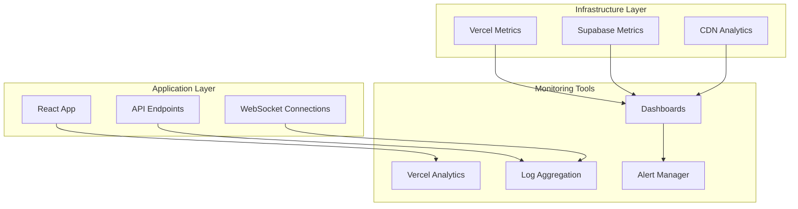

# Monitoring & Alerting Setup

## Overview
This document outlines the monitoring and alerting strategy for the Holistic Wellness Platform.

## Monitoring Architecture



## Key Metrics to Monitor

### 1. Application Performance

#### Frontend Metrics
- **Core Web Vitals**
  - LCP (Largest Contentful Paint): Target < 2.5s
  - FID (First Input Delay): Target < 100ms
  - CLS (Cumulative Layout Shift): Target < 0.1

- **User Experience**
  - Page load time by route
  - JavaScript error rate
  - API response times
  - WebSocket connection stability

#### Backend Metrics
- **API Performance**
  - Response time percentiles (p50, p95, p99)
  - Request rate by endpoint
  - Error rate by endpoint
  - Concurrent connections

### 2. Infrastructure Metrics

#### Database (Supabase)
```javascript
// Key metrics to track
const databaseMetrics = {
  connectionPool: {
    active: 'Current active connections',
    waiting: 'Connections waiting for slot',
    idle: 'Idle connections'
  },
  performance: {
    queryTime: 'Average query execution time',
    slowQueries: 'Queries taking > 1 second',
    deadlocks: 'Deadlock occurrences'
  },
  storage: {
    size: 'Database size in GB',
    growth: 'Daily growth rate',
    tableSize: 'Size per table'
  }
};
```

#### Hosting (Vercel)
- Function execution time
- Function error rate
- Bandwidth usage
- Build times

### 3. Business Metrics

#### User Engagement
```sql
-- Daily Active Users
SELECT COUNT(DISTINCT user_id) as dau
FROM user_activity
WHERE created_at >= CURRENT_DATE;

-- Event Participation Rate
SELECT 
  COUNT(DISTINCT ep.user_id) * 100.0 / COUNT(DISTINCT p.id) as participation_rate
FROM profiles p
LEFT JOIN event_participants ep ON p.id = ep.user_id
WHERE ep.created_at >= CURRENT_DATE - INTERVAL '30 days';
```

#### Platform Health
- New user registrations
- Event creation rate
- Space booking rate
- Message volume
- Notification delivery rate

## Alert Configuration

### Critical Alerts (Immediate Response)

```yaml
alerts:
  - name: "Site Down"
    condition: "Uptime check fails for 2 consecutive checks"
    threshold: "< 95% availability"
    notification: ["pagerduty", "slack-critical"]
    
  - name: "Database Connection Failure"
    condition: "Database unreachable"
    threshold: "> 10 failed connections in 1 minute"
    notification: ["pagerduty", "email-oncall"]
    
  - name: "High Error Rate"
    condition: "API error rate"
    threshold: "> 5% of requests"
    duration: "5 minutes"
    notification: ["slack-critical", "email-team"]
```

### Warning Alerts (Business Hours)

```yaml
warnings:
  - name: "Slow API Response"
    condition: "API p95 response time"
    threshold: "> 500ms"
    duration: "10 minutes"
    notification: ["slack-engineering"]
    
  - name: "High Database Load"
    condition: "Database CPU usage"
    threshold: "> 80%"
    duration: "15 minutes"
    notification: ["slack-engineering", "email-dba"]
    
  - name: "Low Disk Space"
    condition: "Storage usage"
    threshold: "> 85%"
    notification: ["email-devops"]
```

### Business Alerts

```yaml
business_alerts:
  - name: "Low User Engagement"
    condition: "DAU drop"
    threshold: "> 20% decrease from 7-day average"
    notification: ["email-product"]
    
  - name: "Payment Failures"
    condition: "Payment success rate"
    threshold: "< 95%"
    duration: "1 hour"
    notification: ["slack-business", "email-finance"]
```

## Dashboard Setup

### Operations Dashboard

```javascript
// Real-time metrics display
const operationsDashboard = {
  sections: [
    {
      title: "System Health",
      widgets: [
        "Uptime Status",
        "Active Users",
        "API Response Time",
        "Error Rate"
      ]
    },
    {
      title: "Performance",
      widgets: [
        "Page Load Times",
        "Database Query Time",
        "Cache Hit Rate",
        "CDN Performance"
      ]
    },
    {
      title: "Infrastructure",
      widgets: [
        "CPU Usage",
        "Memory Usage",
        "Disk Space",
        "Network I/O"
      ]
    }
  ]
};
```

### Business Dashboard

```javascript
const businessDashboard = {
  sections: [
    {
      title: "User Metrics",
      widgets: [
        "New Registrations",
        "Daily Active Users",
        "User Retention",
        "Geographic Distribution"
      ]
    },
    {
      title: "Engagement",
      widgets: [
        "Events Created",
        "Event Attendance",
        "Space Bookings",
        "Message Volume"
      ]
    },
    {
      title: "Revenue",
      widgets: [
        "Transaction Volume",
        "Payment Success Rate",
        "Revenue by Category",
        "Refund Rate"
      ]
    }
  ]
};
```

## Implementation Guide

### Step 1: Basic Monitoring Setup

```javascript
// frontend/src/utils/monitoring.ts
export const trackEvent = (eventName: string, properties?: any) => {
  // Vercel Analytics
  if (window.analytics) {
    window.analytics.track(eventName, properties);
  }
  
  // Custom tracking
  console.log(`[Analytics] ${eventName}`, properties);
};

// Error tracking
window.addEventListener('error', (event) => {
  trackEvent('javascript_error', {
    message: event.message,
    source: event.filename,
    line: event.lineno,
    column: event.colno,
    error: event.error?.stack
  });
});
```

### Step 2: API Monitoring

```javascript
// Add to API middleware
export const apiMonitoring = async (req, res, next) => {
  const start = Date.now();
  
  res.on('finish', () => {
    const duration = Date.now() - start;
    const metrics = {
      method: req.method,
      path: req.path,
      status: res.statusCode,
      duration,
      userAgent: req.get('user-agent')
    };
    
    // Log metrics
    console.log('[API Metrics]', JSON.stringify(metrics));
    
    // Track slow requests
    if (duration > 1000) {
      console.warn('[Slow API Request]', metrics);
    }
  });
  
  next();
};
```

### Step 3: Database Monitoring

```sql
-- Create monitoring views
CREATE VIEW slow_queries AS
SELECT 
  query,
  calls,
  total_time,
  mean_time,
  max_time
FROM pg_stat_statements
WHERE mean_time > 1000
ORDER BY mean_time DESC;

CREATE VIEW connection_stats AS
SELECT 
  count(*) as total_connections,
  count(*) FILTER (WHERE state = 'active') as active,
  count(*) FILTER (WHERE state = 'idle') as idle,
  count(*) FILTER (WHERE state = 'idle in transaction') as idle_in_transaction
FROM pg_stat_activity;
```

## Incident Response

### Severity Levels

| Level | Description | Response Time | Example |
|-------|-------------|--------------|---------|
| P1 | Critical - Site down | < 15 min | Database outage |
| P2 | Major - Feature broken | < 1 hour | Login not working |
| P3 | Minor - Degraded performance | < 4 hours | Slow page loads |
| P4 | Low - Cosmetic issues | Next business day | UI glitch |

### Response Playbook

1. **Acknowledge** - Respond to alert within SLA
2. **Assess** - Determine impact and severity
3. **Communicate** - Update status page and team
4. **Investigate** - Use monitoring tools to diagnose
5. **Mitigate** - Apply temporary fix if needed
6. **Resolve** - Implement permanent solution
7. **Document** - Create incident report

## Tools and Services

### Recommended Stack

1. **Uptime Monitoring**
   - BetterUptime (free tier available)
   - Uptime Robot
   - Pingdom

2. **Application Monitoring**
   - Vercel Analytics (included)
   - Google Analytics
   - Sentry (error tracking)

3. **Infrastructure Monitoring**
   - Supabase Dashboard (included)
   - Grafana (self-hosted option)
   - Datadog (comprehensive but paid)

4. **Log Management**
   - Vercel Logs (included)
   - LogDNA
   - Papertrail

5. **Alerting**
   - PagerDuty
   - Opsgenie
   - Custom webhooks to Slack/Discord

---

**Next Steps:**
1. Configure Vercel Analytics
2. Set up error tracking with Sentry
3. Create custom dashboards
4. Configure alerting rules
5. Test incident response procedures